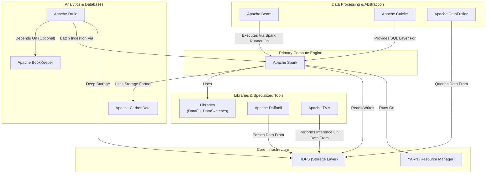

# Manual Hadoop Ecosystem Deployment Guide

This repository provides a comprehensive, step-by-step guide for manually deploying a multi-component big data stack from official binary packages. The guides are designed for bare-metal servers and do not rely on automated tools like Apache Bigtop or containerization like Docker. This approach offers maximum control and transparency into the setup of your data platform.

The instructions support two major Linux distributions: **Debian 12** (`apt`) and **RHEL 9+** (`dnf`).

## Ecosystem Architecture

The following diagram illustrates the final architecture of the deployed components and their relationships. HDFS serves as the foundational storage layer, with YARN managing cluster resources. Spark acts as the primary compute engine, while other specialized tools for analytics, data processing, and machine learning integrate with this core.



## Shared Libraries (`setup_libs.sh`)

This project includes a `setup_libs.sh` script to download common, shared libraries (JAR files) and place them in HDFS. This makes them easily accessible to compute engines like Spark and MapReduce without needing to bundle them with every single application.

### Usage

Run the script from the project root directory:

```bash
./setup_libs.sh
```

The script will download the JARs to a temporary local directory, create a `/apps/jars` directory in HDFS, upload the JARs, and then clean up the local files.

### Configuration Instructions

After running the script, you need to configure your compute engines to automatically use these shared libraries.

#### For Apache Spark (Automatic for all jobs)

Edit your `spark-defaults.conf` file to automatically include these JARs for every application.

1.  **Open the file**: `/opt/spark/conf/spark-defaults.conf`
2.  **Add the `spark.jars` property**:
    ```properties
    # Auto-load shared libraries from HDFS for all jobs
    spark.jars hdfs:///apps/jars/calcite-core-1.36.0.jar,hdfs:///apps/jars/datafu-spark-1.4.0.jar,hdfs:///apps/jars/datasketches-spark-4.2.0.jar,hdfs:///apps/jars/daffodil-runtime1_2.12-3.6.0.jar,hdfs:///apps/jars/arrow-datafusion-core-34.0.0.jar
    ```
3.  **Restart Spark**: Restart your Spark Master and Worker services for the changes to take effect.

#### For Hadoop MapReduce

You can make these libraries available to MapReduce jobs in two primary ways.

**Method 1: Per-Job using `-libjars`**

When submitting a MapReduce job, use the `-libjars` command-line option.

```bash
hadoop jar my-mapreduce-job.jar com.mycompany.MyJob \
-libjars hdfs:///apps/jars/calcite-core-1.36.0.jar,hdfs:///apps/jars/datafu-spark-1.4.0.jar \
/input/path /output/path
```

**Method 2: Cluster-Wide via `mapred-site.xml`**

To make the libraries available to all MapReduce jobs by default, add them to the `mapreduce.application.classpath`.

1.  **Open the file**: `/opt/hadoop/etc/hadoop/mapred-site.xml`
2.  **Add/update the property**:
    ```xml
    <property>
        <name>mapreduce.application.classpath</name>
        <value>
            $HADOOP_MAPRED_HOME/share/hadoop/mapreduce/*,
            $HADOOP_MAPRED_HOME/share/hadoop/mapreduce/lib/*,
            /apps/jars/*
        </value>
    </property>
    ```
3.  **Restart YARN**: Restart the YARN ResourceManager and NodeManagers for the changes to take effect.
